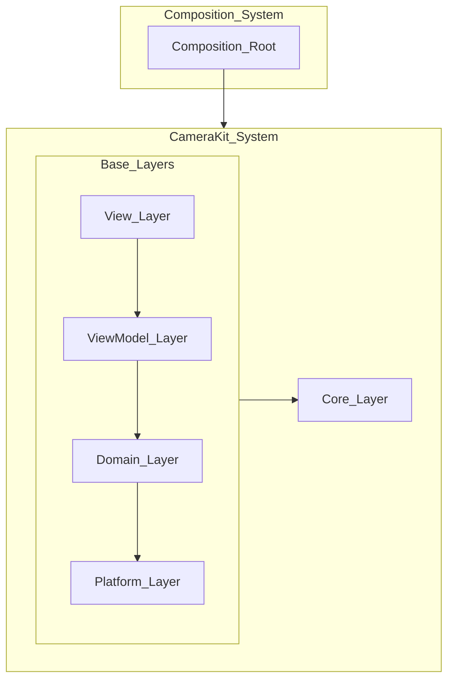

# CameraKit Architecture

**CameraKit** is a modular, protocol-oriented camera framework that uses a pipeline-based design to cleanly separate input, output, and processing concerns. It is designed for extensibility, modern Swift patterns, and high-performance camera workflows—including Metal-accelerated real-time effects.

---

## Architectural Overview

CameraKit is structured into clearly defined layers. The **Composition Root** sits at the top and assembles the entire system. The **Core Layer** provides shared utilities accessible across all layers. Between them sits the main architectural stack consisting of the View, ViewModel, Domain, and Platform layers.

---

## Layer Descriptions

### 1. Composition Root
- Responsible for application setup and dependency injection.
- Constructs and wires all services, pipelines, and layers.
- Has visibility into the entire architecture but is not used by other layers.

### 2. View Layer
- Contains all UI code (SwiftUI, UIKit).
- Presents state and responds to actions.
- Binds directly to ViewModels.

### 3. ViewModel Layer
- Acts as an intermediary between the View and Domain layers.
- Holds UI-ready state and transforms domain results.
- Sends user actions to the Domain layer.

### 4. Domain Layer
- Contains business logic, camera pipelines, and processing abstractions.
- Defines rules, transformations, and pipeline orchestration.
- Uses Platform and Core layers for system-level and shared functionality.

### 5. Platform Layer
- Implements system integrations: AVFoundation, Metal, device handling, permissions.
- Exposes concrete platform services to the Domain layer.

### 6. Core Layer
- Provides shared utilities, configuration, logging, and reusable types.
- Dependency-free and accessible to all layers.
- Does not depend on any higher layer.

---

## Layered Interaction Model

- **Composition Root** wires all dependencies and initializes the system.
- **View Layer** displays ViewModel state and forwards user actions.
- **ViewModel Layer** prepares data for the UI and delegates work to the Domain layer.
- **Domain Layer** performs processing and business logic, using:
  - **Platform Layer** for system APIs and hardware access.
  - **Core Layer** for shared utilities.
- **Core Layer** remains independent and is used across the framework without depending on any other layer.

---

## Responsibility Matrix

| Layer             | Responsibilities                                             | Depends On           |
|------------------|---------------------------------------------------------------|-----------------------|
| Composition Root | Setup, wiring, dependency injection                          | All layers            |
| View Layer       | UI rendering, user interaction                               | ViewModel, Core       |
| ViewModel Layer  | State management, UI-friendly transformations                | Domain, Core          |
| Domain Layer     | Business logic, pipelines, processing                        | Platform, Core        |
| Platform Layer   | AVFoundation, Metal, device and OS interactions               | Core                  |
| Core Layer       | Shared utilities, types, logging, configuration               | None                  |

---

## Architecture Diagram

