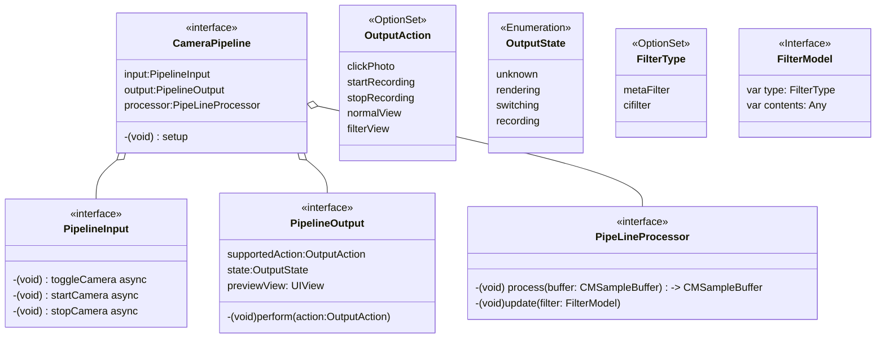
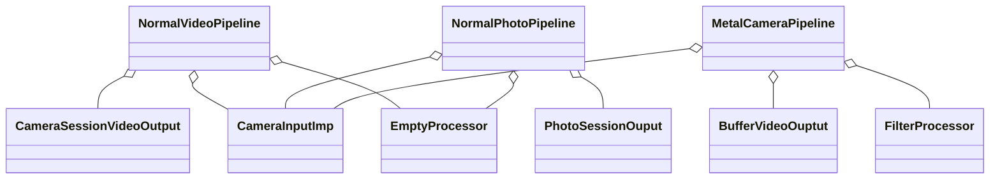

# Camera
Creating camera decoupled

```mermaid
classDiagram
direction TD

class CameraPipeline {
<<interface>> 
input:PipelineInput
output:PipelineOutput
processor:PipeLineProcessor
-(void)setup

}

class PipelineInput {
<<interface>>
-(void) toggleCamera async
-(void) startCamera async
-(void) stopCamera async
}

class PipelineOutput {
<<interface>>
supportedAction:OutputAction
state:OutputState
previewView: UIView
-(void)perform(action:OutputAction)
}

class PipeLineProcessor {
<<interface>>
-(void) process(buffer: CMSampleBuffer) -> CMSampleBuffer
-(void)update(filter: FilterModel)
}


CameraPipeline o-- PipelineInput
CameraPipeline o-- PipelineOutput
CameraPipeline o-- PipeLineProcessor


class OutputAction {
<<OptionSet>>
clickPhoto
startRecording
stopRecording
normalView
filterView
}

class OutputState {
<<Enumeration>>
unknown
rendering
switching
recording
}

class FilterType {
    <<OptionSet>>
   metaFilter
	cifilter
}

class FilterModel {
		<<Interface>>
    var type: FilterType 
    var contents: Any 
}

```

``` mermaid
classDiagram
direction TD

class NormalVideoPipeline {
 
} 

NormalVideoPipeline o-- CameraSessionVideoOutput 
NormalVideoPipeline o-- CameraInputImp
NormalVideoPipeline o-- EmptyProcessor

class NormalPhotoPipeline {
 
} 


NormalPhotoPipeline o-- PhotoSessionOuput 
NormalPhotoPipeline o-- CameraInputImp
NormalPhotoPipeline o-- EmptyProcessor


class MetalCameraPipeline

MetalCameraPipeline o-- BufferVideoOuptut 
MetalCameraPipeline o-- CameraInputImp
MetalCameraPipeline o-- FilterProcessor


```

